# 如何在PKU校园内网中优雅的使用路由器

纯GUI操作用上公网ipv6

## 网络架构介绍

PKU校园网经过了几次改动，截止2022年10月3日，内网有`PKU`、`PKU Secure`、宿舍有线网等接入点。本文重点描述如何在宿舍有线网接口环境下进行路由器配置，并获取公网ipv6地址。

校园网内网的网段为`10.0.0.0/8`，网段分布和联通性如下。

```plaintext
10.129.0.0/16  宿舍有线网
10.{2|3|4|5}.0.0/16  校园无线网

校园无线网 --> 宿舍有线网 连通
校园无线网 --> 校园无线网 AP隔离
宿舍有线网 --> 宿舍有线网 连通
宿舍有线网 --> 校园无线网 未测试
```

## 宿舍路由器

对于设备比较多的人来说，4个设备的上网限制是明显不够滴，这样在宿舍部署路由器就成了必选项。ipv4地址必须只能有一个，因为校园网网关的限制。同时还想要用上公网ipv6（我可以不用，但是地址不能没有！qwq）。

我的路由器选择是`Newifi-D2`（用了好多年了），系统选择了原生的`OpenWrt 22.03.0`最新版系统

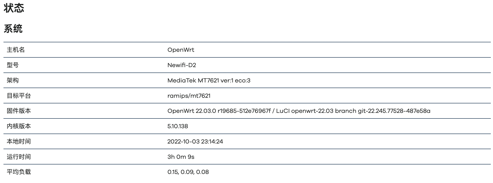

## 网络设备配置过程

我的路由器有4个`LAN`口和1个`WAN`口，我将LAN1、LAN2配置为桥接到WAN（以防万一需要使用“校内公网地址”），LAN3、LAN4保持标准的LAN

设置页面在"网络>接口>设备"下

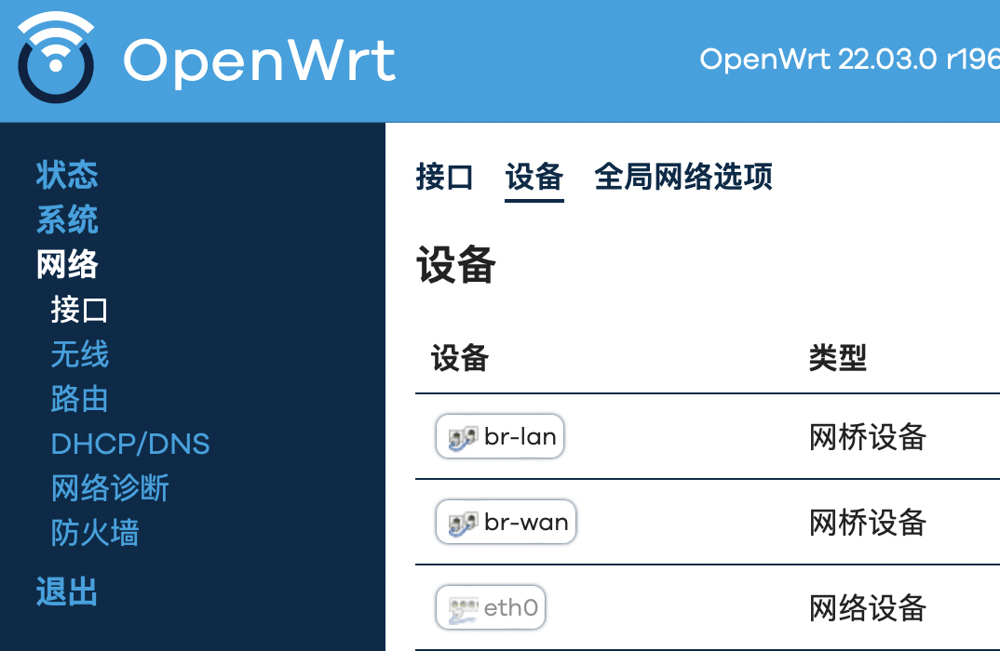
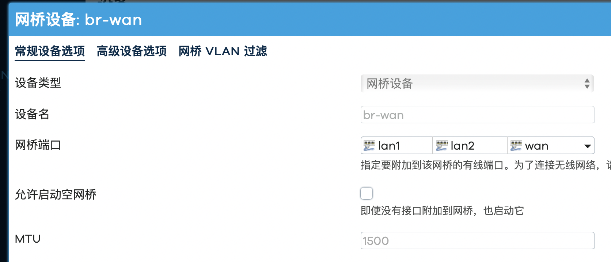

## 接口配置过程

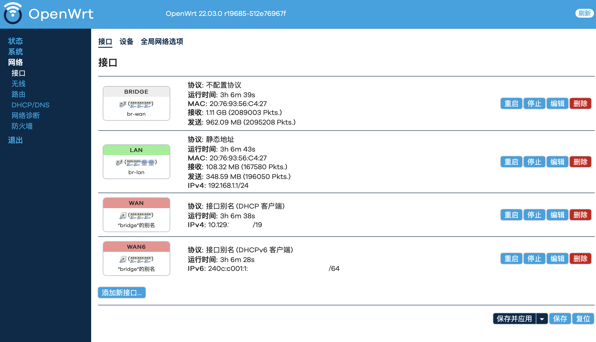

1. 新建`BRIDGE`设备作为`WAN`侧的桥接设备，选择不配置协议，在”配置-DHCP服务器“中选择“忽略此接口”,ipv6选择禁用。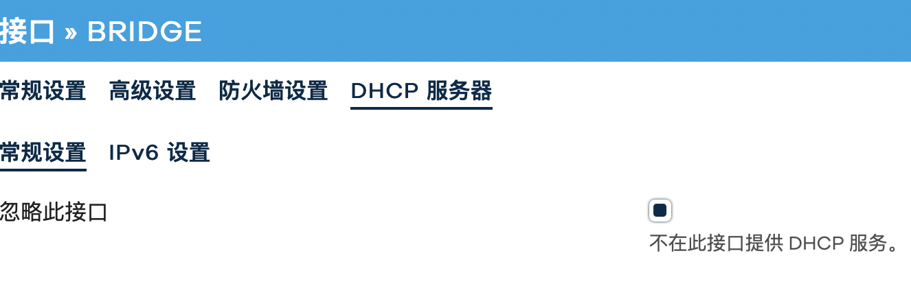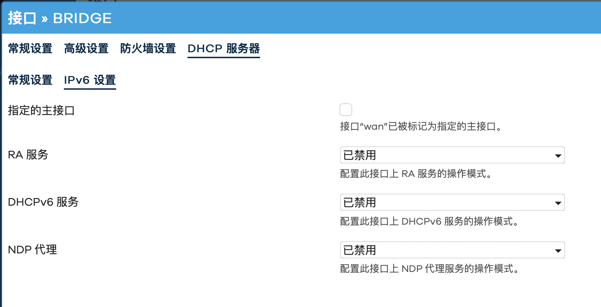
2. 新建`WAN``WAN6`接口，设备选择`@bridge`,其中`WAN`协议选择`DHCP客户端`，`WAN6`协议选择`DHCPv6客户端`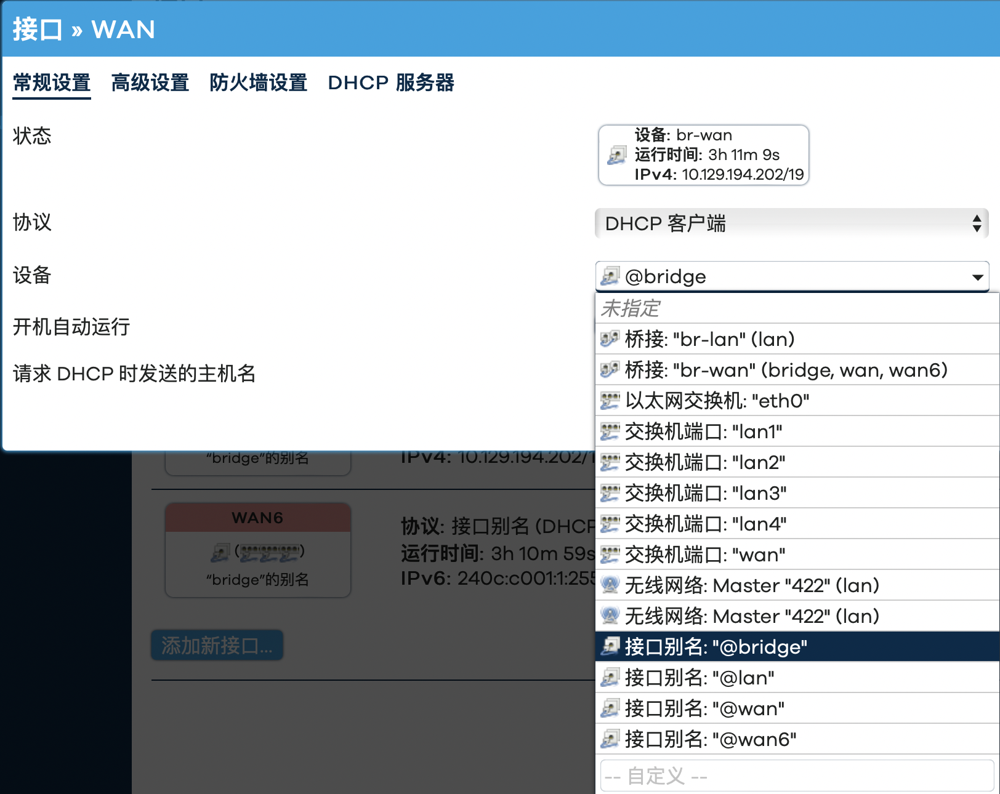
3. 类似第一步，在`WAN`接口配置中`DHCP服务器`常规设置选择忽略此接口，ipv6配置选择中继模式，同时勾选指定为主接口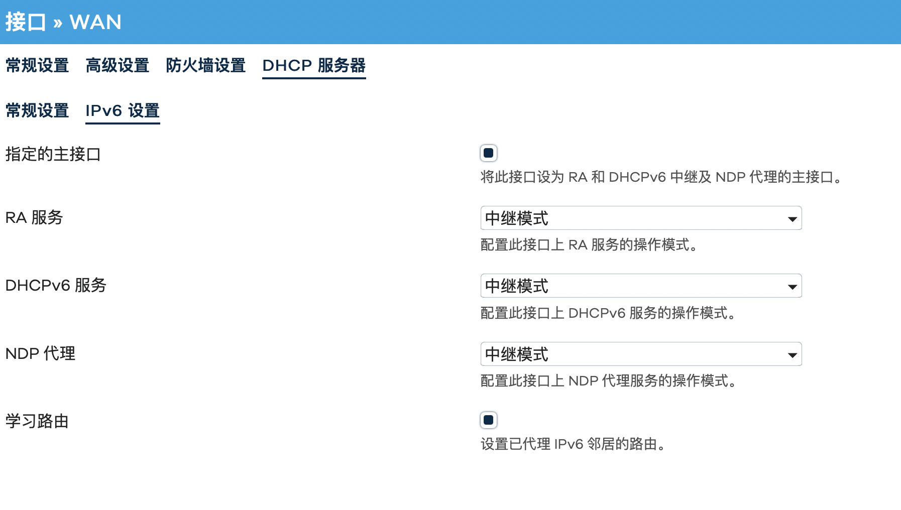
4. 在`LAN`接口配置中，ipv6选择中继模式,不要勾选指定为主接口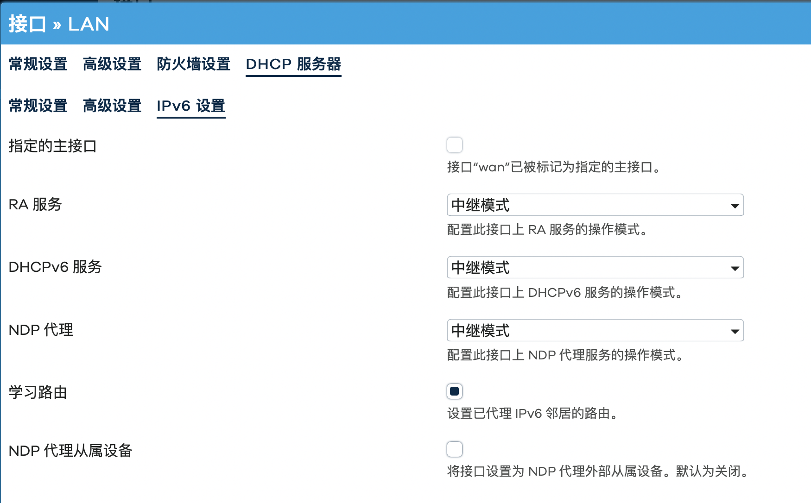
5. 其余接口的DHCP服务器ipv6均选择禁用。

然后就能愉快使用ipv6了

## 使用内网服务

这里还踩了个坑，openwrt的端口映射没用，实际上是防火墙配置不对

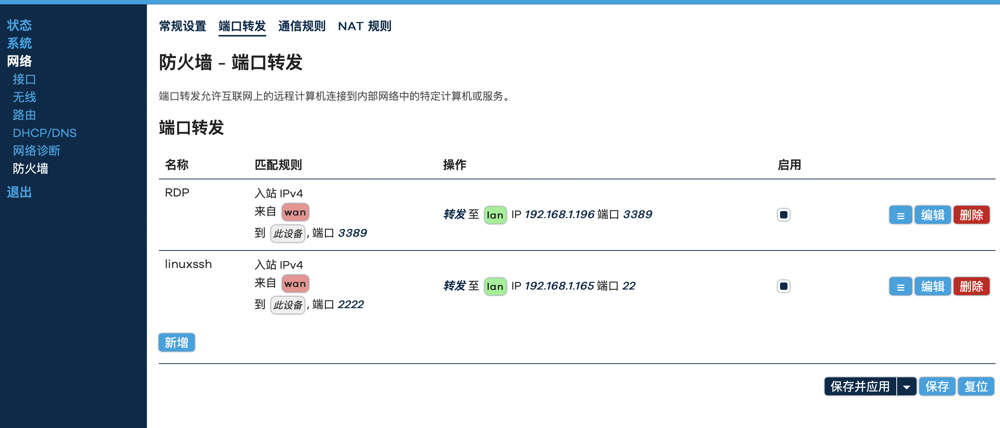

应该在常规设置中修改为允许，特别注意配置`wan->lan`区域，**要选择允许转发到目标区域**。

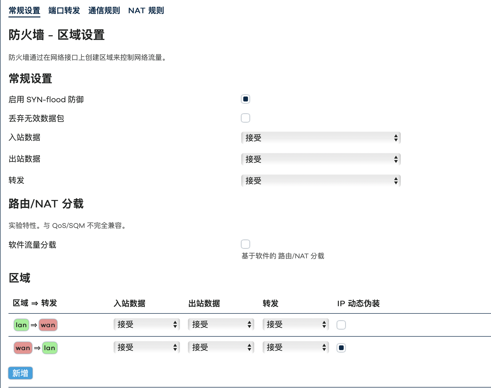
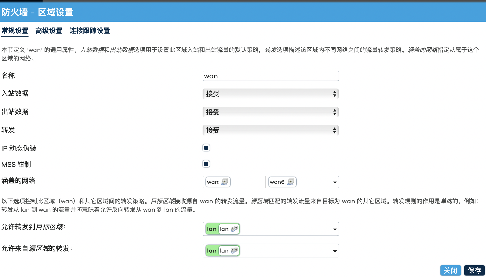

就能愉快的在校园内网访问路由器下的服务了！
